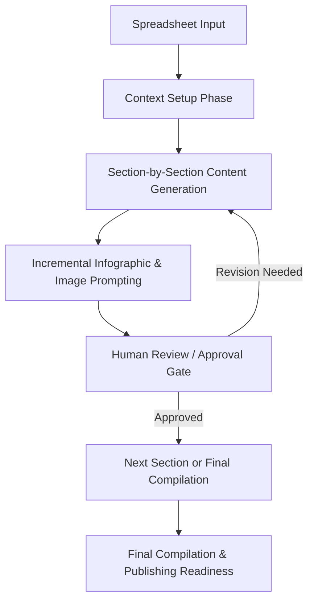

# Outline-Based Blog Generator Agent Workflow

## Objective

Build an AI-powered **Blog Generator Agent** that creates long-form, SEO-optimized blog content **incrementally**, generating content **one outline section at a time** instead of producing the full blog in a single response.

The agent must study and align with the writing style, structure, SEO practices, and content depth of the reference blog:
* [https://tsttechnology.io/blog/saas-development-checklist](https://tsttechnology.io/blog/saas-development-checklist)

This approach ensures higher quality, better human review, and controlled content generation.

---

## Key Constraint (Mandatory)

* The LLM **must follow the outline sequentially**.
* **Only one outline section is generated per step**.
* The agent must **pause after each section** and wait for explicit approval or instruction to proceed.
* Full blog generation in a single pass is **strictly prohibited**.

---

## Input Data Source

The agent consumes structured data from a spreadsheet (`content.csv`) with the following columns:

* **No**: Serial number.
* **Tone**: Desired tone of the article (e.g., Informational).
* **Title**: Blog post title.
* **Slug**: URL slug.
* **Primary Keyword**: Main keyword for SEO.
* **Secondary Keywords**: Additional keywords to include.
* **Target Audience**: Who the blog is for.
* **Outline**: Structured outline (e.g., H2, H3 headings).
* **Word Count**: Range of words expected.
* **E-E-A-T Writing Instruction**: Detailed style guide including:
    *   *Tone & Style* (Active voice, conversational).
    *   *Word Choice* (Simple words, avoid jargon).
    *   *Formatting* (paragraph length, sentence length).
    *   *SEO constraints* (Keyword density).
* **FAQs**: List of questions to answer.
* **Author**: Author name.
* **Reference Link**: External links to reference.
* **Table of Content**: (Optional) specific TOC instructions.
* **Tags**: Blog tags.
* **Image include**: whether to include images.
* **Image Prompts**: Output column for generated prompts.
* **Publish date**: Scheduled date.
* **Hero Image**: Path/URL for hero image.
* **Inbox banner Image**: Path/URL for banner.
* **Status**: Current status.
* **Link**: Published link.

---

## Workflow Overview

---

## Phase 1: Context Setup

Before generating any content, the agent must:

1.  **Parse and Understand**:
    *   **Core Metadata**: Title, slug, audience, keywords.
    *   **Structure**: Complete outline (H2/H3 hierarchy).
    *   **Detailed Style Constraints** (from E-E-A-T column):
        *   Sentence length limits (e.g., max 15-20 words).
        *   Paragraph limits (e.g., max 3-5 sentences).
        *   Voice (Active vs Passive).
        *   Keyword density targets (0.8-1.2%).
2.  **Build Internal Context**: Initialize planning memory with these constraints.
3.  **No Generation**: Do not generate any blog content in this phase.

---

## Phase 2: Section-Wise Blog Generation

For each outline item (processed in order):

### Step-by-Step Rules

1.  **Select**: Pick the current outline section (H2 or H3).
2.  **Generate**: Write content *only* for this section.
3.  **Ensure Strict Adherence**:
    *   **Style**: Check against parsed constraints (sentence length, active voice).
    *   **SEO**: Natural placement of Primary/Secondary keywords (if applicable to this section).
    *   **Formatting**: Short paragraphs, use of bullets/bolding for scannability.
    *   **Content**: Clear explanations, actionable insights, E-E-A-T principles.
4.  **Avoid**:
    *   Repeating content from earlier sections.
    *   Writing conclusions, FAQs, or CTAs prematurely.
5.  **Stop**: Halt immediately after completing the section.

➡️ **Await approval** before proceeding to the next outline item.

---

## Phase 3: Incremental Infographic & Image Prompting

For every generated section:

*   **Infographics**:
    *   Extract key points/data suitable for visualization.
    *   Store as structured infographic blocks (Title, Key Bullets, Data).
*   **Image Prompts**:
    *   If `Hero Image` or `Inbox banner Image` are required but missing, generate detailed text-to-image prompts.
    *   Generate a prompt relevant to the specific section if an inline image is warranted (based on `Image include` flag).
*   *Note*: Content grows **in parallel** with blog sections.

---

## Phase 4: Quality Guardrails

Each section must pass these specific checks:

*   **Metric Check**: Are sentences <20 words? Are paragraphs <5 sentences?
*   **SEO Check**: Is keyword density within range (accumulated)?
*   **Tone Check**: Is it conversational? Is jargon explained?
*   **E-E-A-T**: Does it demonstrate expertise? Are stats linked/cited?

---

## Phase 5: Final Compilation (Post Approval)

Once all outline sections are generated and approved:

1.  **Merge**: Combine all sections into a single blog document.
2.  **FAQ**: Generate FAQs from the provided input (or enhance if needed).
3.  **Final Review**:
    *   Perform final readability/SEO scan on the full text.
    *   Ensure all constraints (Word Count, Audience) are met.
4.  **Asset Finalization**:
    *   Compile infographic outline.
    *   Finalize list of Image Prompts (Hero, Banner, Inline).
5.  **Publishing**: Prepare content for CMS or Markdown/HTML publishing.

---

## Final Outputs

### 1. Blog Output
*   Markdown-ready blog content.
*   Structured headings (H1–H4).
*   SEO-optimized and E-E-A-T compliant.
*   Author attribution and reference links included.

### 2. Infographic & Asset Output
*   Section-wise infographic outline.
*   Text-to-visual infographic mapping.
*   **Image Prompts**: Ready-to-use prompts for Hero, Banner, and inline images.

---

## Key Benefits
*   **High Precision**: Strict adherence to specific style guides (sentence/paragraph length).
*   **Consistency**: Maintained tone across section-by-section generation.
*   **Visual Readiness**: Parallel creation of infographic/image briefs.
*   **Scalability**: Structured input allows for automated processing of multiple topics.
